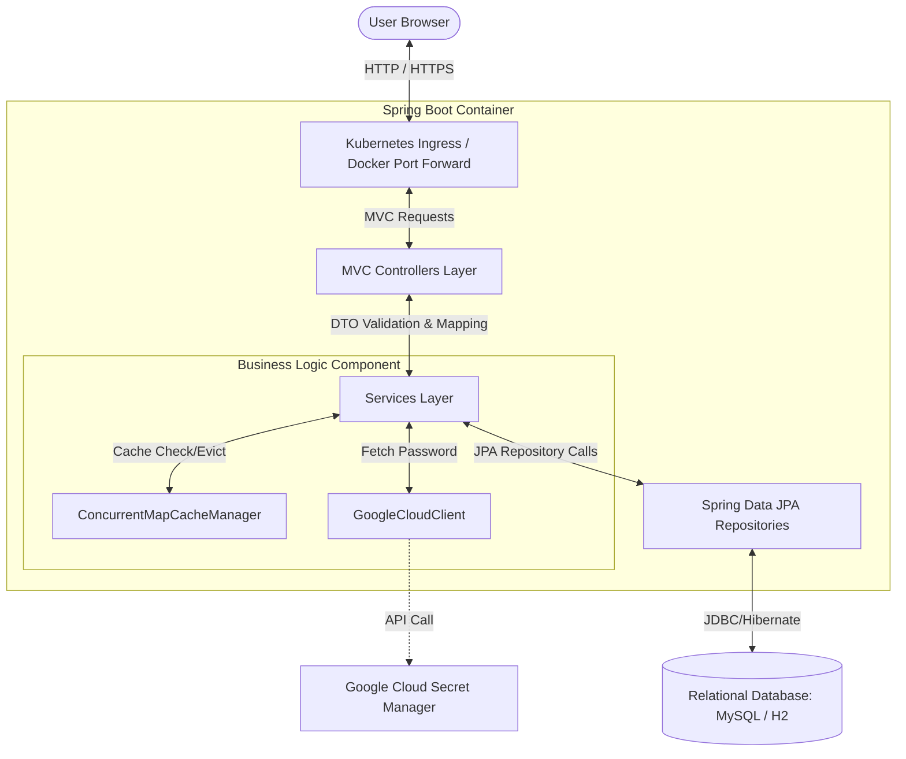
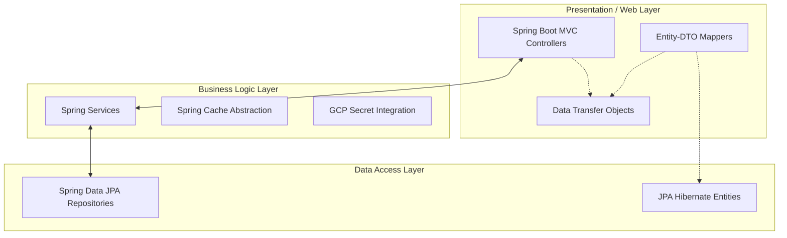
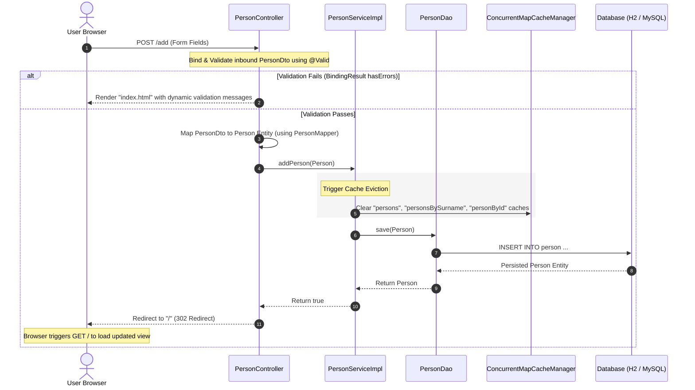
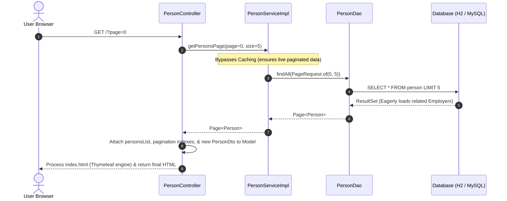
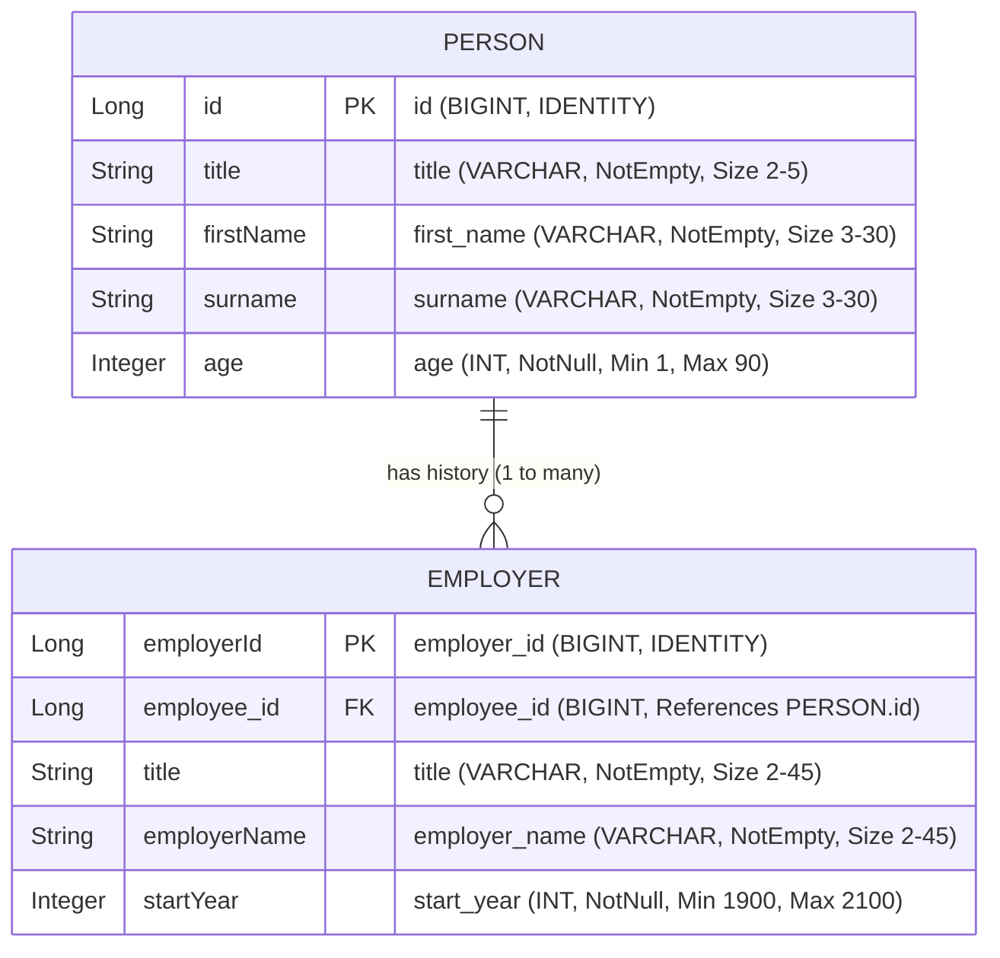

# iRonoc-DB Architecture Documentation

This document provides a comprehensive overview of the technical architecture of **iRonoc-DB**, a sample data manager application. It covers the system topology, layered Java backend, Thymeleaf-based frontend, database integrations (local and cloud), caching, and request/response data lifecycles.

---

## 1. High-Level System Architecture

iRonoc-DB is built on a containerized, cloud-ready stack using Java 25 and Spring Boot 4. The application is designed to run in multiple environments, ranging from local developer workspaces utilizing Docker Compose or Minikube to production Kubernetes platforms like Google Kubernetes Engine (GKE).

The system architecture consists of a client browser interacting with a containerized Spring Boot web server. The backend manages relational persistence through localized or remote database environments, integrates with Google Cloud Secret Manager for credentials protection, and maintains high performance via on-heap caching.

### 1.1 System Architecture Diagram

The component diagram below outlines the topology and networking boundaries of the system across standard deployment configurations:



### 1.2 Deployment & Environment Run Modes

The system operates under two primary profiles configured in the Maven/Gradle build system and Spring Boot's application properties:

1. **Development/Local Memory Mode (`h2` profile):**
   - **Database:** An in-memory **H2 Database** instance (`jdbc:h2:mem:ironoc_db`).
   - **Credentials Management:** Instead of local hardcoding, the database password is dynamically retrieved from **Google Cloud Secret Manager** at startup using a custom client wrapper. This enforces strict credential protection even in non-production local profiles.
   - **Console:** The H2 Web Console is exposed under `/h2-console` for interactive runtime debugging.

2. **Standard Relational Mode (`mysql` profile):**
   - **Database:** A **MySQL database** running inside a separate Docker Compose container or hosted externally (e.g., Google Cloud SQL).
   - **Credentials Management:** Pulls connection parameters (`DB_URL`, `DB_USERNAME`, `DB_PASSWORD`) directly from environment variables.

---

## 2. Layered Java Backend Overview

The backend conforms to the classical **Layered (3-Tier) Architecture** to ensure clean separation of concerns, high testability, and structural integrity.



### 2.1 Component Breakdown

#### A. Web / Controller Layer
- **MVC Controller Routing:** Classes like `PersonController` and `EmployerController` map client HTTP requests to model-view resolutions. They act as traffic directors, orchestrating request flow.
- **Global Controller Advice:** `VersionController` is configured with `@ControllerAdvice` and a global `@ModelAttribute("applicationVersion")` model provider. This automatically injects the parsed compilation version into all dynamic templates without requiring repetitive attribute loading across other endpoints.
- **Custom Error Handling:** `CustomErrorController` implements Spring Boot's `ErrorController` to capture unhandled exceptions or 404s, logging diagnostic attributes (HTTP status, exception messages, request URI) and routing requests cleanly to custom error UI (`error404.html`).

#### B. Service & Business Logic Layer
- **Interface Segregation:** Services are structured with clean contracts (`PersonService`, `EmployerService`) and explicit implementations (`PersonServiceImpl`, `EmployerServiceImpl`).
- **External Integration Services:** `GoogleCloudClient` leverages the official Google Cloud SDK client `SecretManagerServiceClient` to fetch the H2 instance password dynamically from cloud secrets vaults at runtime.

#### C. Data Access & Persistence Layer (DAO)
- **Spring Data JPA Repositories:** Repository interfaces (`PersonDao`, `EmployerDao`) inherit from standard interfaces (`JpaRepository`, `CrudRepository`).
- **Database Transactions:** Crucial write or read-update operations are enclosed in `@Transactional` annotations to enforce ACID transactions.

#### D. Boundary Model Strategy: Entities vs. DTOs
To prevent the leakage of Hibernate state, circular mapping, or database constraints into the web presentation tier, iRonoc-DB strictly enforces a DTO/Entity boundary:
- **Entities (`Person`, `Employer`):** Map directly to SQL relational structures via JPA annotations (`@Entity`, `@Table`, `@ManyToOne`, `@OneToMany`). They handle lifecycle cascade behaviors.
- **DTOs (`PersonDto`, `EmployerDto`):** Flat Java objects containing request-bound properties, fully isolated from JPA tracking.
- **Mappers (`PersonMapper`):** A custom Spring bean that surgically maps back and forth between DTOs and Entities during inbound requests or outbound model loads.

#### E. Strict Form Validation
Input validation uses standard **Jakarta Bean Validation** constraints configured directly on the DTO properties. 

Example attributes:
- `@NotEmpty` and `@Size(min = 3, max = 30)` for text parameters like `firstName` and `surname`.
- `@Min` and `@Max` constraints for numeric properties such as `age` and `startYear`.
- Controller endpoints enforce validation via the `@Valid` trigger. If the bound inputs violate a constraint, Spring's `BindingResult` gathers the failure details, bypasses database interactions, and pushes the errors back to the UI view where they are rendered.

#### F. High-Performance Spring Caching
The application includes on-heap cache management to avoid expensive query execution for repetitive lookups.
- **Configuration:** The `ConcurrentMapCacheManager` is initialized as a bean inside `IronocDbConfig`.
- **Caching Annotations:**
  - `@Cacheable`: Applied to heavy-read queries like `getAllPersons()`, `findPersonBySurname(String surname)` and `findPersonById(Long id)`.
  - `@CacheEvict`: Configured under `@Caching` arrays on state-modifying actions (such as `addPerson`, `deletePersonBySurname`, `deletePersonById`) to flush stagnant cached results and maintain data consistency.
  - **Dynamic Pagination Isolation:** Paginated queries (`getPersonsPage`) are intentionally isolated from caching to guarantee real-time data accuracy during client sorting or record shifts.

---

## 3. Thymeleaf Frontend Overview

iRonoc-DB leverages a dynamic server-side rendering architecture. Web pages are constructed dynamically in memory on the Spring container using the **Thymeleaf Template Engine** before the final HTML is streamed to the user's browser.

### 3.1 Architecture of Thymeleaf Templates
The frontend UI is designed with a high level of modularity and layout reuse:

```
src/main/resources/templates/
├── index.html                  # Main dashboard layout
├── navbar.html                 # Common navigation bar component
├── add-employee.html           # Inline employee creation form
├── employee-list.html          # Paginated table display of workers & job history
├── edit-person.html            # Dedicated person modifier view
├── job-history.html            # Individual job experience list & creation view
├── edit-job-history.html       # Job experience record modification form
└── error404.html               # Custom graceful error page
```

- **Layout Composition:** Templates are dynamically composed using Thymeleaf's fragment expression syntax (`th:replace`). `index.html` serves as a master container, injecting the reusable header navbar, the add form panel, and the list component.
- **Interactive Forms:** Forms utilize Spring-Thymeleaf binding features like `th:object` (mapping a DTO model) and `th:field` (automatically binding form controls to model fields).
- **Inline Error Feedback:** Fields check for validation failures using `th:if="${#fields.hasErrors('fieldName')}"` and render the constraint's custom error messages in red helper text directly below the target inputs (`th:errors="*{fieldName}"`).
- **Pagination Controls:** The `employee-list.html` component contains conditional pagination buttons powered by calculation utilities (`#numbers.sequence(0, totalPages - 1)`), highlighting active pages and disabling edge controls via standard conditional attributes (`th:classappend`).

### 3.2 Static Resources & UI Libraries
- **Styles & Layout:** The system utilizes **Bootstrap 4** (pulled via CDN) for responsive design and structural spacing, layered with a custom stylesheet (`/style/main.css`) to define customized elements like version badges and page-specific branding.
- **Icons:** **Font Awesome 5** is used to render icons for UI actions like edit, delete, and add buttons.
- **Static Content Handling:** Images (e.g., `/img/robot-logo.png`) and application banners are resolved via Spring Boot's automatic static resource handler, serving files directly from the `/static` folder.

---

## 4. Data Flows & Lifecycle Sequences

### 4.1 Create Record Flow (Adding an Employee)

The sequence diagram below displays the lifecycle of an inbound POST request designed to create a new `Person` record, highlighting form validation, entity mapping, and cache flushing:



### 4.2 Read Record Flow (Paginated List Retrieval)

The sequence diagram below shows how the default paginated view is served to the client:



---

## 5. Detailed Relational Schema & Entity Relationships

The core database schema manages two tables: `person` and `employer`. These represent a strict **One-to-Many Relationship** where an employee can have multiple historical job experience entries in the database.

### 5.1 Entity Relationship Diagram



### 5.2 Relationship Lifecycle Controls
- **Eager Fetching:** The `@OneToMany` relationship on the `Person` entity utilizes `FetchType.EAGER` fetching. This ensures that when a person is loaded from the database, their associated list of employers is retrieved in a single unified operation, streamlining the nested table layout within the HTML UI.
- **Cascade Deletion:** The relationship is configured with `CascadeType.REMOVE` (also represented as `ON DELETE CASCADE` in the schema). When a `Person` entity is deleted, Hibernate automatically propagates the deletion to remove all associated `Employer` history records, preventing relational orphaned entries and enforcing strict database integrity.
